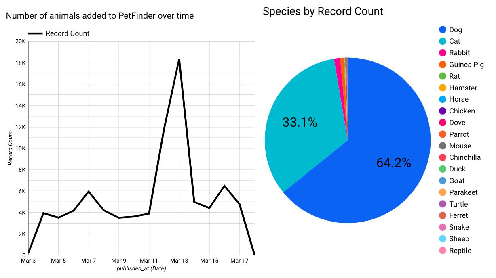

# :paw_prints: PetFinder API Data Pipeline


*Image Created Using AI

---

[](https://www.python.org/)
[](https://opensource.org/licenses/MIT)
[](https://www.petfinder.com/developers/)
[](https://cloud.google.com/)
[](https://cloud.google.com/bigquery)
[](https://github.com/features/actions)
[](https://www.terraform.io/)
[](https://www.getdbt.com/)
[](https://cloud.google.com/looker)
[](https://github.com/)


## 📖 Evaluation Criteria as Table of Contents

**Based on Project rubric**
- [:question: Problem Description](#question-problem-description)
- [:building_construction: Pipeline Architecture](#pipeline-architecture)
- [:cloud: Cloud](#cloud-cloud)
- [:violin: Batch / Workflow Orchestration](#violin-batch--workflow-orchestration)
- [:file_cabinet: Data Warehouse](#data-warehouse)
- [:arrows_counterclockwise: Transformations](#transformations)
- [:rocket: Dashboard Visualization](#dashboard)
- [:recycle: Reproducibility / Setup Instructions](#reproducibility)
- [:wrench: Technologies Used](#technologies-used)
- [:bulb: Lessons Learned](#lessons-learned)

---

TODO - Backfill, add log, bug script is grabbing 800, which is back in time...this may lead to duplicates. Thus
I have updated that script and will test it 3/17 and then will need my backfill for ALL data could work actually?
Ok, need to add a catch do it doesn't keep running...look at tomorrow.

https://lookerstudio.google.com/embed/reporting/eab4cbae-a022-470a-88dc-15de1ab4a255/page/oenBF


## :question: Problem description

The **problem** is the challenge of handling, processing, and visualizing pet adoption data from 
Pet Finder API [docs](https://www.petfinder.com/developers/v2/docs/) in an automated, 
scalable, and efficient manner. The **solution** is an end-to-end data pipeline leveraging 
**Python, Terraform, DBT, Google BigQuery, and Google Cloud Storage**, with automation via **GitHub Actions**.

## :building_construction: Pipeline Architecture

The architecture of the data pipeline involves several components:

1. **Data Ingestion**: Extracting pet adoption data from the PetFinder API using Python. Automated with Github Actions cron job.
2. **Storage & Processing**: Using **Google Cloud Storage (GCS) as a data lake** and **Python with Terraform** for automation.  
3. **Data Warehousing**: Moving processed data from GCS to **Google BigQuery** using Python.  
4. **Data Transformation**: Using **DBT** to clean, model, and optimize data by processing and transforming the data for meaningful insights using partitioning and clustering. 
5. **Visualization**: Creating a **Google Data Studio Looker dashboard** with 2 tiles of insights on pet adoption trends.  
6. **Automation**: Using **GitHub Actions** for automated daily batch processing.

:warning: Note that the user must manually create an account for [PetFinder API](https://www.petfinder.com/developers/v2/docs/), 
update Github Actions, and create a Google Cloud account. 


## :cloud: Cloud

This project utilizes Google Cloud Platform (GCP) services including Google Cloud Storage (GCS) Data Lake
and BigQuery Data Warehouse for data storage and processing. This project uses Terraform `Infrastructure as Code (IaC)` to automate 
the setup and management of cloud resources including the GCP bucket for the data lake.

## :violin: Batch / Workflow orchestration

This project uses Github Actions and runs batches daily. The workflow orchestration pipeline is:

- Automatically ingesting daily data from the API into the cloud storage (data lake).
- Moving data from the data lake to BigQuery (data warehouse).
- Transforming data using dbt.
- Visualizing data in Looker.

## :file_cabinet: Data warehouse

This project uses BigQuery for the data warehouse and the tables are partitioned and clustered. For the petfinder
dataset, I partition by processed date, and then cluster by species, age group, and state.

## :arrows_counterclockwise: Transformations 

The **DBT** transformations take place in **BigQuery**, where raw data is cleaned and prepared for analysis.
The transformation script is as follows:

```SQL

-- models/transformations/transformed_petfinder.sql
{{ config(
    materialized='table',
    partition_by={'field': 'published_at', 'data_type': 'TIMESTAMP'},
    cluster_by=['species', 'age_group', 'state']
) }}

WITH cleaned_data AS (
    SELECT
        id,
        name,
        species,
        age,
        gender,
        size,
        primary_breed,
        primary_color,
        CAST(spayed_neutered AS BOOL) AS spayed_neutered,
        CAST(house_trained AS BOOL) AS house_trained,
        CAST(declawed AS BOOL) AS declawed,
        CAST(special_needs AS BOOL) AS special_needs,
        CAST(shots_current AS BOOL) AS shots_current,
        CAST(good_with_children AS BOOL) AS good_with_children,
        CAST(good_with_dogs AS BOOL) AS good_with_dogs,
        CAST(good_with_cats AS BOOL) AS good_with_cats,
        tags,
        location,
        SPLIT(location, ', ')[SAFE_OFFSET(0)] AS city,
        SPLIT(location, ', ')[SAFE_OFFSET(1)] AS state,
        postcode,
        published_at,
        organization_id,
        email,
        CASE
            WHEN ARRAY_LENGTH(SPLIT(tags, ', ')) > 0 THEN ARRAY_TO_STRING(SPLIT(tags, ', '), ', ')
            ELSE NULL
        END AS tags_string,
        CASE
            WHEN age = 'Baby' THEN '0-1 years'
            WHEN age = 'Young' THEN '1-3 years'
            WHEN age = 'Adult' THEN '3-7 years'
            WHEN age = 'Senior' THEN '7+ years'
            ELSE 'Unknown'
        END AS age_group
    FROM {{ ref('stg_petfinder') }}
)

SELECT * FROM cleaned_data

```


## :rocket: Dashboard Visualization

**Google Data Studio - Looker** to create and share the dashboard.

After loading the transformed data into BigQuery, a dashboard to visualize key metrics and trends in pet adoption:
- **Tile 1**: A pie chart showing the distribution of dogs vs. cats.
- **Tile 2**: A time series chart showing the number of adoptions of cats and dogs time.



:bulb: If you need a how-to for looker, go here:
https://www.youtube.com/watch?v=39nLTs74A3E

[](https://youtu.be/{39nLTs74A3E?si=z20nZmb3ty-8siXc})

## :recycle: Reproducibility / Setup Instructions

### **API Key and Access Token Setup**

Data Source

The data is sourced from the **PetFinder API**, which provides information about adoptable pets from various organizations. 
The dataset includes details such as pet names, types, ages, breeds, and adoption statuses.

- PetFinder API documentation: [PetFinder API Documentation](https://www.petfinder.com/developers/)

To use the PetFinder API, you need to obtain your **API key** and **API secret** from PetFinder. Here's how to get them:

1. **Sign up for an account** on PetFinder:
   - Visit [PetFinder API](https://www.petfinder.com/developers/) to sign up and create a developer account.
   - Once logged in, go to the [API Key Management](https://www.petfinder.com/developers/) page to generate your API key and secret.

2. **Get Access Token**:
   After you have your **API key** and **API secret**, you'll need to generate an **access token** to authenticate your API requests.

   Use the following `curl` command (or a Python script) to get the access token:
   ```bash
   curl -d "grant_type=client_credentials&client_id={YOUR-CLIENT-ID}&client_secret={YOUR-CLIENT-SECRET}" https://api.petfinder.com/v2/oauth2/token
   ```
   
   Replace `{YOUR-CLIENT-ID}` and `{YOUR-CLIENT-SECRET}` with your own **API Key** and **API Secret**.

   The response will look something like this:
   ```json
   {
     "token_type": "bearer",
     "expires_in": 3600,
     "access_token": "your_access_token_here"
   }
   ```

3. **Set up environment variables**:
   - Store your **API key**, **API secret**, and **access token** in your environment variables for security and convenience.

   For example, in your terminal (Linux/macOS):
   ```bash
   export PETFINDER_API_KEY="your-client-id"
   export PETFINDER_API_SECRET="your-client-secret"
   export PETFINDER_ACCESS_TOKEN="your-access-token"
   ```

   Or, for Windows (using PowerShell):
   ```bash
   $env:PETFINDER_API_KEY="your-client-id"
   $env:PETFINDER_API_SECRET="your-client-secret"
   $env:PETFINDER_ACCESS_TOKEN="your-access-token"
   ```

4. **Use the Access Token**:
   After setting up the environment variables, the program will use the access token to authenticate requests to the PetFinder API.


### **Important Notes**:
- Each user needs to create their own API key and access token as **they are unique to each user**.
- The access token typically expires after an hour, so you'll need to refresh it periodically.
- Make sure not to share your **API key** and **secret** publicly to avoid unauthorized access.


### **Clone/Fork This Repo in Gihub**

1. **Fork/Clone the repository**:
   - Fork it to your GitHub account.
   - This is mandatory, as I use CI/CD Github Actions

2. **Set up secrets**:
   - Go to the repository's **Settings** > **Secrets and variables** > **Actions**.
   - Add the following secrets:
     - `GCP_CREDENTIALS`: Google Cloud credentials file (as a JSON string).
     - `PETFINDER_API_KEY`: PetFinder API key.
     - `PETFINDER_API_ID`: PetFinder API ID.

3. **Ensure dependencies are listed** in the `requirements.txt` file:
   - Make sure the `requirements.txt` file includes all the required dependencies for the project.
   - Install dependencies via the following command:
     ```bash
     pip install -r requirements.txt
     ```

4. **Review the README**:
   - Go through the README for any specific environment setup or instructions related to the cloud environment and the pipeline.

5. **Wait for the Action to Run**:
   - The scheduled GitHub Action will automatically trigger according to the defined schedule (e.g., daily at midnight UTC).
   - Alternatively, the action can be manually triggered via the **GitHub Actions tab** in the repository.

### Steps to Create a Google Cloud Project

1. **Sign in to Google Cloud Console**:
   - Visit the [Google Cloud Console](https://console.cloud.google.com/).
   - Sign in with your Google account. If you don't have one, you will need to create an account.

2. **Create a Google Cloud Project**:
   - If you don't have a project yet, you'll need to create one.
     1. In the Cloud Console, click on the **project drop-down** at the top of the page.
     2. Click **New Project**.
     3. Name your project, select your billing account (if prompted), and choose a location.
     4. Click **Create**.

3. **Enable Google Cloud Storage API**:
   - In the Cloud Console, navigate to the **APIs & Services** > **Library**.
   - Search for **Google Cloud Storage** in the search bar and select **Google Cloud Storage JSON API**.
   - Click **Enable** to enable the API for your project.

4. **Create a Service Account**:
   - Navigate to **IAM & Admin** > **Service Accounts** in the Google Cloud Console.
   - Click **Create Service Account**.
     1. **Service Account Name**: Enter a name (e.g., `petfinder-api-access`).
     2. **Role**: Choose **Project > Owner** (or a more restrictive role if needed).
     3. In the **Role** dropdown, select **Storage Object Admin**.
     4. **Key**: Under **Key**, select **JSON**. This will generate a key file that you'll download, which will be used in your Python script to authenticate.
   - Click **Create** and save the downloaded JSON key to a secure location on your machine.

# TODO Delete below, this is done with terraform and Secrets in Github
5. **Create a Google Cloud Storage Bucket**:
   - In the Google Cloud Console, go to the **Cloud Storage** section: **Storage** > **Browser**.
   - Click **Create Bucket**.
     1. **Bucket Name**: Choose a globally unique name for your bucket (e.g., `my-petfinder-bucket-12345`).
     2. **Location Type**: Choose the location (e.g., **Multi-region** or **Region**). For simplicity, you can choose a **Multi-region** location such as `US`.
     3. **Storage Class**: Select the default storage class (e.g., **Standard**).
     4. Click **Create**.

6. **[IF NEEDED] To Adjust Permissions for Your Service Account**:
   - In the **IAM & Admin** section, click **IAM**.
   - Re-download key: Click the three vertical dots next to your service account and select **Manage Keys**

7. **Use the Bucket and Service Account in Your Script**:
   - In your Python script, set the `credentials_file` path to the downloaded JSON file for the service account.
   - Set the `bucket_name` to the name of the bucket you created in step 5.

...
In your `main()` function in petfinder_data_loader.py `PetFinderDataLoader`, use the following values:

```python
credentials_file = '/path/to/your/service-account-file.json'  # Path to your Service Account JSON key
bucket_name = 'your-gcs-bucket-name'  # Replace with the name of your bucket
```

### Additional Notes:
- **Bucket Naming Convention**: The bucket name must be globally unique across Google Cloud. Try appending random numbers or using unique prefixes.
- **Service Account Key**: Keep the service account JSON file secure. It's used for authenticating your application to Google Cloud services.


---

## :wrench: Technologies Used

- **Google Cloud Storage (GCS)**: For storing raw data before and after processing.
- **Python**: For writing scripts to handle data ingestion.
- **PetFinderAPI**: Datasource
- **Terraform**: Infrastructure as code (IaC) - Used for creating GCP Bucket and BigQuery
- **DBT**: For performing SQL-based transformations on the data in BigQuery.
- **BigQuery Data Warehouse**: For storing processed and transformed data in a data warehouse.
- **Visualization Tools**: Google Data Studio Looker


---

## :bulb: Lessons Learned

- **CD/CI & Github Actions**: Learned how to use yml files to run terraform and python using Github Actions
- **Batch Processing**: Learning how to process large datasets efficiently with Spark was key to handling the PetFinder data at scale.
- **Transformation Best Practices**: Using DBT for transformations made it easier to maintain and version control SQL-based transformations, ensuring the integrity of the data.
- **Cloud Integration**: Integrating with **Google Cloud Storage** and **BigQuery** enabled me to scale the pipeline and store data securely for analysis.

---

## License

This project is licensed under the MIT License - see the [LICENSE](LICENSE) file for details.

